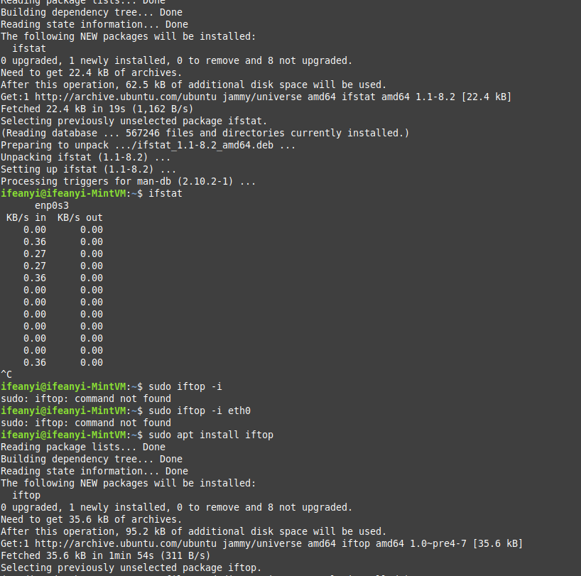

#Task Completed
- Connect and login to your server, preferably using an ssh client (used putty)

- Run a few simple commands to check the status of your server
Commands like: 
lsb_release -a = to see which distro you are running. 
uname -a = system info 
uptime = how long system has been running 
whoami= username 

lscpu = cpu architecture
lsblk = block devices eg harddrive
lspci = pci devices
lsusb = usb devices

free -h / vmstat = memory statistics
top = task manager
df -h = disk space

netstat -i / ifstat = static and continious view

